# 🛒 Decoding the Cart Test: A Step-by-Step Guide

This guide breaks down exactly what happens when you run the **"should display product in cart page"** test in `cart.spec.js`.

We will focus on understanding where the objects come from and how the data flows.

---

## 🔍 The Test Block

Here is the code we are analyzing:

```javascript
test('should display product in cart page', async ({ authenticatedPage }) => {
    // 1. Unpacking the toolbox (Destructuring)
    const { dashboardPage, cartPage } = authenticatedPage;

    // 2. Getting data
    const product = excelReader.getProductByName('Sauce Labs Bolt T-Shirt');

    // 3. Using the tools
    await dashboardPage.addProductToCartByName(product.productName);
    await dashboardPage.clickCartIcon();
    
    // ... verification steps ...
});
```

---

## 📦 The Mystery Line: Object Destructuring

The most confusing line is often this one:

```javascript
const { dashboardPage, cartPage } = authenticatedPage;
```

### ❓ Question: "Where do `dashboardPage` and `cartPage` come from? I didn't import them!"

**Answer:** They come from the **`authenticatedPage`** fixture!

Think of `authenticatedPage` not as a single page, but as a **Swiss Army Knife** 🇨🇭 that the fixture gives you.

When the fixture runs (before your test), it packages everything into one object:

```javascript
// Inside authFixture.js
await use({ 
    loginPage,      // Tool #1
    dashboardPage,  // Tool #2
    cartPage,       // Tool #3
    page            // Tool #4 (The browser tab itself)
});
```

So when you write `const { dashboardPage, cartPage } = authenticatedPage;`, you are saying:

> "Open the `authenticatedPage` box, and take out **ONLY** the `dashboardPage` and `cartPage` tools. I don't need the others right now."

This is a JavaScript feature called **Destructuring**.

---

## 🎬 The Execution Movie: Frame by Frame

Here is the exact sequence of events for this specific test:

```mermaid
sequenceDiagram
    participant Test as 🧪 Test Case
    participant Fixture as 🤖 Auth Fixture
    participant Dashboard as 🏠 DashboardPage
    participant Cart as 🛒 CartPage

    Note over Test, Fixture: 1. Setup Phase
    Test->>Fixture: "I need authenticatedPage!"
    Fixture->>Fixture: Logs in automatically...
    Fixture-->>Test: Returns { dashboardPage, cartPage, ... }

    Note over Test, Dashboard: 2. Action Phase
    Test->>Dashboard: addProductToCartByName("Bolt T-Shirt")
    Dashboard->>Dashboard: Clicks "Add to Cart" button
    
    Test->>Dashboard: clickCartIcon()
    Dashboard->>Dashboard: Clicks Cart Icon
    Dashboard-->>Test: Navigation complete

    Note over Test, Cart: 3. Verification Phase
    Test->>Cart: isOnCartPage()
    Cart-->>Test: Returns true ✅
    
    Test->>Cart: isProductInCart("Bolt T-Shirt")
    Cart-->>Test: Returns true ✅
    
    Test->>Cart: getProductDetails(...)
    Cart-->>Test: Returns { price: "$15.99", ... }
    
    Note over Test: 4. Assertion
    Test->>Test: Expect price to be "$15.99" ✅
```



---

## 🧠 Key Takeaways

1.  **Fixtures are Containers**: The `authenticatedPage` fixture is a container holding all your Page Objects (`dashboardPage`, `cartPage`, etc.).
2.  **Destructuring**: We extract only the pages we need for the specific test.
3.  **No Imports Needed**: You don't import `DashboardPage` at the top of `cart.spec.js` because the **Fixture** already imported it, created it, and passed it to you ready-to-use.

Happy Testing! 🚀
